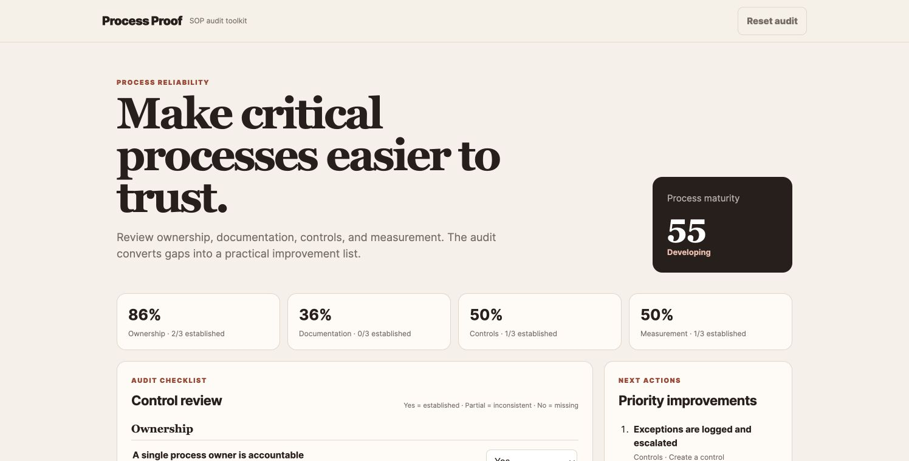

# Process Proof — SOP Audit Toolkit

[](https://github.com/coo-tools/sop-audit-toolkit/actions/workflows/test.yml)
[](https://coo-tools.github.io/sop-audit-toolkit/)
[](LICENSE)

A browser-based diagnostic for reviewing the reliability of a standard operating procedure. It scores four control areas and converts gaps into a prioritized action plan.

**[Open the live application](https://coo-tools.github.io/sop-audit-toolkit/)**



## Audit areas

- Ownership and continuity
- Documentation quality
- Risk controls and exception handling
- Performance measurement

## Features

- Weighted audit score and process-maturity label
- Section-level scoring
- Prioritized improvement list based on gap severity
- Markdown action-plan export
- Local browser storage
- Unit-tested scoring logic

## Decision logic

Each control has a business-risk weight. **Yes** receives full credit, **Partial** receives half credit, and **No** or **Not reviewed** receives no credit. Open gaps are ranked by weight and missing-control severity.

## Run locally

```bash
python3 -m http.server 8000
```

Visit `http://localhost:8000`.

## Quality checks

```bash
npm test
```

The same checks run automatically on every pull request and every change to `main`. See [TESTING.md](TESTING.md) for manual acceptance scenarios.

## Scope

This is a lightweight operational diagnostic. It is not a substitute for a legal, safety, information-security, or regulatory audit.

## Project status

Version 1.0 is a stable, client-side baseline. Planned improvements are tracked in GitHub Issues. Contributions are welcome through [CONTRIBUTING.md](CONTRIBUTING.md).

## License

MIT
